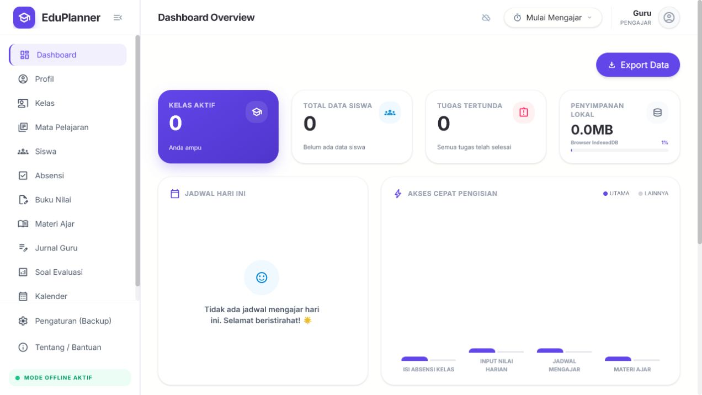
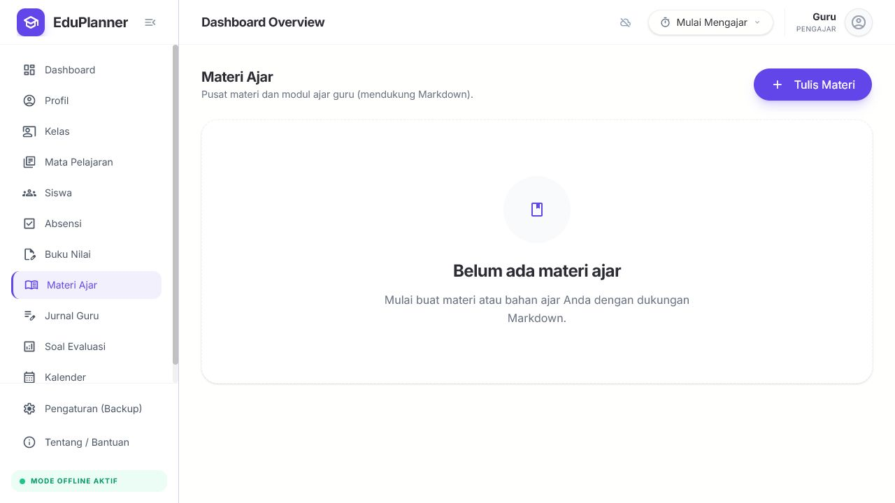
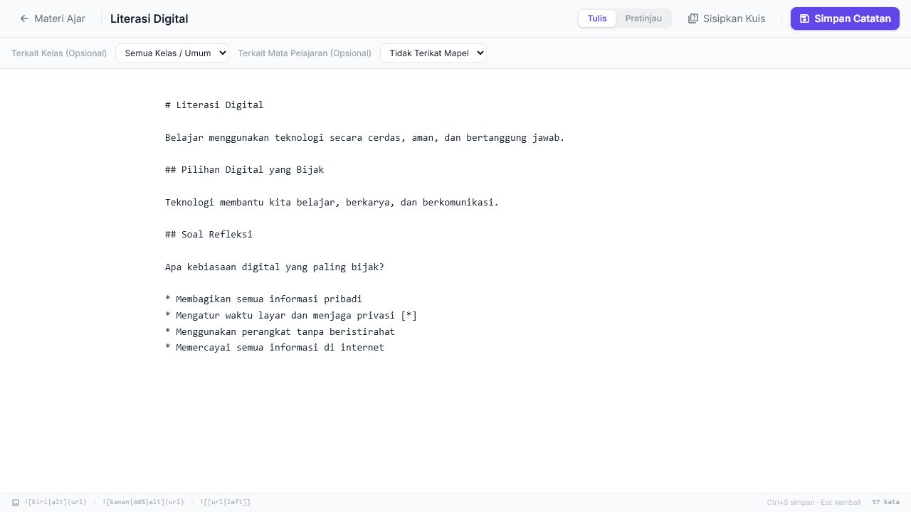
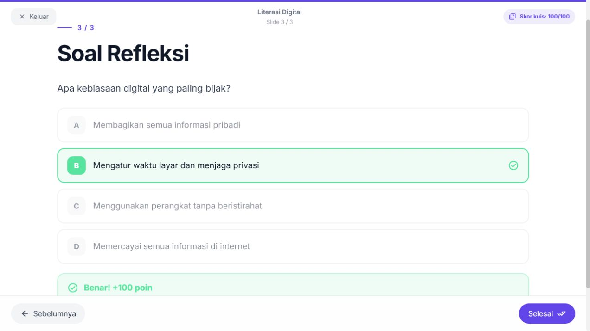

# EduPlanner Local

EduPlanner Local is an offline-first teacher workspace for managing classes, students, subjects, attendance, grades, teaching materials, journals, evaluations, schedules, tasks, and teaching-session history.

The application is a client-side React PWA. Its primary database is IndexedDB on the current browser profile; no backend is required for normal daily use.

> [!IMPORTANT]
> This repository is currently a functional beta. Local JSON backup/restore covers every database table and includes validation, a recovery snapshot, preview, and transactional restore. The optional mock provider is for development/demo use only; remote cloud backup is not implemented. Review [Backup and restore](#backup-and-restore) and [Current limitations](#current-limitations) before using EduPlanner for irreplaceable records.

## Feature status

Status meanings:

- **Complete**: implemented and available in the current UI.
- **Partial**: usable, with a documented limitation or integrity issue.
- **Mock**: a local development/demo simulation, not the remote service its interface may represent.
- **Not implemented**: the feature is not available.

| Feature | Status | Notes |
| --- | --- | --- |
| Offline IndexedDB storage | Complete | Dexie schema version 7 with 11 tables. |
| Installable/offline PWA shell | Complete | Generated by `vite-plugin-pwa`; cached assets support offline reloads, while new versions require an explicit user update choice. |
| Dashboard and teaching analytics | Complete | Includes class/student totals, tasks, attendance, grades, schedules, and teaching hours. |
| Class management | Complete | CRUD works; deletion atomically removes students and all class-owned records, subject enrollment references, and active timer state. |
| Subject management | Complete | CRUD and student assignment work. Deletion atomically removes the subject link from grades, attendance, tasks, notes, and recurring schedules; schedules are preserved as general class schedules. |
| Student management | Complete | CRUD and Excel roster import work; direct deletion from both student views transactionally removes attendance, grades, notes, and subject enrollment references. |
| Attendance tracking and charts | Partial | Per class/date/subject entry works; undo after the first save on an empty date does not yet remove the newly created records. |
| Spreadsheet-like gradebook | Complete | Virtual rows, keyboard navigation, evaluation columns, averages, grade undo/redo, and transactional collision-safe column renaming. |
| Teaching materials and Markdown presentation | Complete | Markdown editing, reading, image rendering, and full-screen slide navigation. |
| Journals and Markdown quizzes | Complete | Teacher journals, evaluation authoring, quiz parsing, scoring, and results. |
| Calendar, tasks, and recurring schedules | Complete | Daily, weekly, and monthly schedules plus tagged tasks. |
| Class reminders | Partial | Native browser notifications are checked while the application is open. Lock-screen previews hide class, subject, and time details by default; detailed previews require an explicit opt-in. This is not a server push/background scheduling service. |
| Teaching time tracker | Complete | Active timer persistence and IndexedDB teaching-session history. |
| Indonesian and English UI | Complete | Language preference is stored locally. |
| Light/dark/system theme | Partial | Main theme preference works; the toast wrapper still reads a separate theme context. |
| Global undo/redo | Partial | Implemented for grade edits and attendance saves, not every mutation. |
| Local JSON backup and restore | Complete | Versioned file backups cover all 11 tables. Restore includes structural and relational validation, legacy migration, a record-count preview, a pre-restore recovery snapshot, and an atomic transaction. |
| Local mock backup provider | Mock | `LocalMockSyncProvider` stores and restores a backup from `localStorage` in the same browser and origin. It is development/demo functionality only. |
| Remote cloud sync | Not implemented | There is no remote provider, authentication, backend, cross-device sync, or multi-user service. |
| Gemini/AI integration | Not implemented | No AI client SDK, API-key configuration, or application feature is installed. Any future integration must use a trusted server boundary. |

## Screenshots

The screenshots below use an empty dataset and anonymous sample material. They do not contain student or class names.

### Dashboard



### Teaching materials



### Markdown material editor



### Embedded presentation quiz



## Internationalization

EduPlanner supports Indonesian (`id`) and English (`en`) throughout the teacher-facing interface. The selected language is stored locally in the browser, so it survives refreshes without requiring an account or backend service.

Translations live in `src/hooks/dict.ts` and are accessed with `useTranslation()`. CI tests keep the Indonesian and English key structures in sync, so new open-source contributions should add both language strings for every new user-facing label, toast, dialog, tooltip, and empty state.

User-authored content, such as class names, student names, subjects, materials, journals, and evaluation questions, is shown exactly as entered and is not automatically translated.

## Backup and restore

EduPlanner is local-first and does not require a backend. The available storage and backup mechanisms are intentionally different:

| Mechanism | Location | Intended use | Important limitation |
| --- | --- | --- | --- |
| Application data | IndexedDB in the current browser profile and origin | Normal day-to-day use | Clearing site/browser storage can permanently remove the data. |
| Downloaded JSON backup | A file saved by the user | Durable backup and transfer between compatible EduPlanner origins | The file can contain sensitive educational records and must be stored securely. |
| Local mock provider | `localStorage` in the current browser profile and origin | Development and demonstrations | It is not cloud storage, is unavailable from another browser/origin/device, and can be deleted with browser storage. |
| Remote cloud backup | Not available | — | No data is uploaded to a remote backup service. |

Before a file or mock backup replaces local data, EduPlanner validates its structure and relationships, shows a preview with record counts and migration warnings, and prepares a recovery snapshot of the current database. The user must download that snapshot and explicitly confirm the destructive restore. Because a browser cannot verify that a download was actually saved, the user must confirm that the recovery file is safely stored before continuing.

Restore writes all tables in one transaction and runs a final integrity check. A validation error or transactional failure does not partially replace the existing database. Backups created by supported legacy versions are migrated through explicit rules; backups from a newer, unsupported application version are rejected.

The local mock provider follows the same safe restore workflow, but it is not a substitute for a downloaded backup stored somewhere safe. There is no authentication, backend, remote cloud provider, or multi-user separation.

## Content syntax

### Markdown presentations

Teaching materials are split into slides at H2 headings (`## `). Content before the first H2 becomes the cover slide. A valid quiz block can be placed anywhere among those slides, including at the beginning for recalling the previous meeting or at the end for checking understanding after the lesson.

Controls include Arrow Right/Space for next, Arrow Left for previous, Escape to exit, click zones, and slide-outline navigation.

```markdown
# Cover title
Cover description.

## Introduction
First slide content.

## Main topic
Second slide content.

## Closing question
Which idea was discussed in this lesson?
* First option
* Correct option [*]
* Third option
```

### Markdown quizzes

Evaluation documents and embedded presentation quizzes use H2 headings for questions and `* ` or `- ` list items for answers. Append `[*]` to the correct option.

```markdown
## Question 1
Which number is prime?
* 4
* 6
* 11 [*]
```

The quiz view distributes 100 points across valid questions and shows progress, immediate feedback, a final score, and answer review.

## Requirements

- Node.js 20.19.x or Node.js 22.12 and newer
- npm (the repository includes `package-lock.json`)
- A modern browser with IndexedDB support

## Quick start

```bash
git clone https://github.com/enisdalibra/EduPlanner.git
cd EduPlanner
npm install
npm run dev
```

Open `http://localhost:3000`. Vite uses localhost by default because this project does not configure a public host.

Useful commands:

| Command | Purpose |
| --- | --- |
| `npm run dev` | Start the development server on port 3000. |
| `npm run lint` | Run TypeScript checking with no emit. |
| `npm test -- --run` | Run the test suite once. |
| `npm run test:coverage` | Run tests and generate V8 coverage. |
| `npm run build` | Create the production PWA bundle in `dist/`. |
| `npm run preview` | Preview the production build at `http://127.0.0.1:4173`. |
| `npm run verify` | Run type-check, coverage, build/PWA checks, and the full dependency audit. |
| `npm run release:check` | Alias for `npm run verify`, retained for release workflows. |

No runtime environment variable or `.env` file is required. Static subpath builds
may set the build-time-only `DEPLOY_BASE_PATH` in the invoking shell. Environment
files are intentionally ignored and rejected by the repository privacy check;
never place private API keys in a client bundle.

## Architecture

The current interface and design system are React/TypeScript based. The
authoritative contributor guidance is in [design.md](design.md); legacy
Vanilla JavaScript and CDN examples are archived for historical reference only.

```text
React feature view / shared component
              |
              +--> feature API or service --> Dexie --> IndexedDB
              |                                  |
              +<--------- useLiveQuery ----------+

Zustand persist --> UI preferences, timer, sync metadata
Zustand memory  --> undo/redo callbacks
Service worker  --> PWA asset caching
```

The preferred dependency direction is `view -> feature API/service -> Dexie`.
Grade, attendance, note, task, schedule, teaching-session, student, and subject
assignment writes validate their applicable parent relationships inside the
same transaction as the mutation. Attendance writes also protect immutable
record scope and natural-key uniqueness. Deleting a note preserves teaching
history while transactionally clearing its optional note link. Some existing
views still write directly to Dexie; moving those mutations behind domain APIs
is planned technical work rather than the current invariant.

### Database tables

The current Dexie database contains:

`profile`, `subjects`, `classes`, `students`, `attendances`, `grades`, `notes`, `tasks`, `teachingSessions`, `studentNotes`, and `schedules`.

### Repository structure

```text
.
|-- src/
|   |-- components/   # Layout, shared components, and UI primitives
|   |-- db/           # Dexie models, schema, and indexes
|   |-- features/     # Route-level domain features and feature APIs
|   |-- hooks/        # Theme, translation, shortcuts, sync, reminders
|   |-- lib/          # Validation, schedule, Markdown, quiz utilities
|   |-- services/     # Excel, calculation, and sync helpers
|   `-- store/        # Zustand state
|-- __tests__/        # Vitest suites
|-- design.md         # Project visual design rules
|-- vite.config.ts    # Vite, Tailwind, and PWA configuration
`-- vitest.config.ts  # Test and coverage configuration
```

## Technology stack

- React 19 and TypeScript
- Vite 6 and `vite-plugin-pwa`
- Tailwind CSS 4 with shadcn/Base UI components
- Dexie and `dexie-react-hooks`
- Zustand
- React Router using `HashRouter`
- TanStack React Virtual
- React Markdown and remark-gfm
- Recharts and date-fns
- Self-hosted, build-time-subset Material Symbols Rounded icons
- `read-excel-file` and `write-excel-file` for `.xlsx` roster files
- Vitest, Testing Library, and jsdom

## Current limitations

- Remote cloud sync is not implemented. The available `LocalMockSyncProvider` is a same-browser, same-origin development/demo simulation backed by `localStorage`.
- Deleting site data can remove both the IndexedDB application database and the mock backup. Keep downloaded JSON backups in a separate, secure location.
- Excel roster import accepts `.xlsx`; legacy `.xls` and CSV files are not supported.
- Validation is applied by several feature APIs but is not global database middleware.
- Browser reminders require the application to be running and notification permission to be granted.
- PWA updates wait for user confirmation. Save current work before selecting
  **Update now**, because applying the update reloads the application.
- There is no authentication, multi-user separation, backend, or container configuration. GitHub Pages deployment is an explicit manual workflow.

## Data and security notes

- Educational records remain in the current browser profile unless the user explicitly exports a file. Enabling the mock provider only copies a backup to `localStorage` in that same browser and origin; it does not send data over the internet.
- IndexedDB data is not application-level encrypted. Protect the device and browser profile.
- Exported JSON and Excel files may contain sensitive student information and should be stored securely.
- User-authored fields have centralized length limits enforced by domain APIs,
  imports, and backup restore. Major limits include 120 characters for names,
  200 for titles, 5,000 for descriptions, 10,000 for student notes, and 500,000
  for teaching-material or journal Markdown. Evaluation-column renames use the
  same name limit at the API boundary, even when invoked outside the UI.
- The application does not currently send educational records to a backend or analytics service.
- No API key is injected into the browser bundle. Future AI integrations must use a trusted server boundary rather than Vite environment replacement.
- Markdown images from another origin are blocked until the user explicitly chooses to load each URL. Only HTTPS remote images are eligible, and they are fetched with a `no-referrer` policy.
- `index.html` receives a production-only CSP baseline at build time; development WebSocket origins are not shipped. Production hosting should also send the equivalent `Content-Security-Policy` header and add `frame-ancestors 'none'`; `frame-ancestors` cannot be enforced from an HTML `<meta>` policy, and GitHub Pages does not support repository-controlled custom response headers. Use a header-capable host when this protection is required.

See [Privacy and data](docs/privacy-and-data.md) for storage locations, deletion
and transfer guidance, shared-device risks, and privacy-safe security reporting.

## Performance budgets

Production builds regenerate a Material Symbols subset, lazy-load the Excel reader
and writer only when their actions are requested, and enforce these limits:

- initial JavaScript: 750 KiB uncompressed;
- any lazy JavaScript chunk: 500 KiB uncompressed;
- total offline precache: 2.5 MiB.

`npm run build` fails if a budget is exceeded or the generated service worker does
not precache the application shell and all generated assets.

## Deployment

See [Deployment and rollback](docs/deployment.md) for local preview, root/subpath
hosting, security and cache headers, the manual GitHub Pages workflow, release
verification, and rollback procedures.

## User documentation

- [User guide](docs/user-guide.md)
- [Backup and restore](docs/backup-and-restore.md)
- [Importing students](docs/importing-students.md)
- [Troubleshooting](docs/troubleshooting.md)
- [Privacy and data](docs/privacy-and-data.md)

## Contributing

Read [Contributing](CONTRIBUTING.md) before opening an issue or pull request.
Contributions must use synthetic data and must never include real student
records, rosters, backups, browser profiles, or sensitive logs.

Security vulnerabilities should be reported privately according to the
[Security Policy](SECURITY.md). Community participation is governed by the
[Code of Conduct](CODE_OF_CONDUCT.md), and notable project changes are recorded
in the [Changelog](CHANGELOG.md).

## License

EduPlanner Local is available under the [MIT License](LICENSE).

Bundled fonts remain under their respective upstream licenses. The complete
copyright notices, SIL Open Font License 1.1 for Inter, Apache License 2.0 for
Material Symbols, and the Material Symbols subset modification notice are
provided in [Third-Party Notices](public/THIRD_PARTY_NOTICES.txt). The same
notice file is included in every production build.
